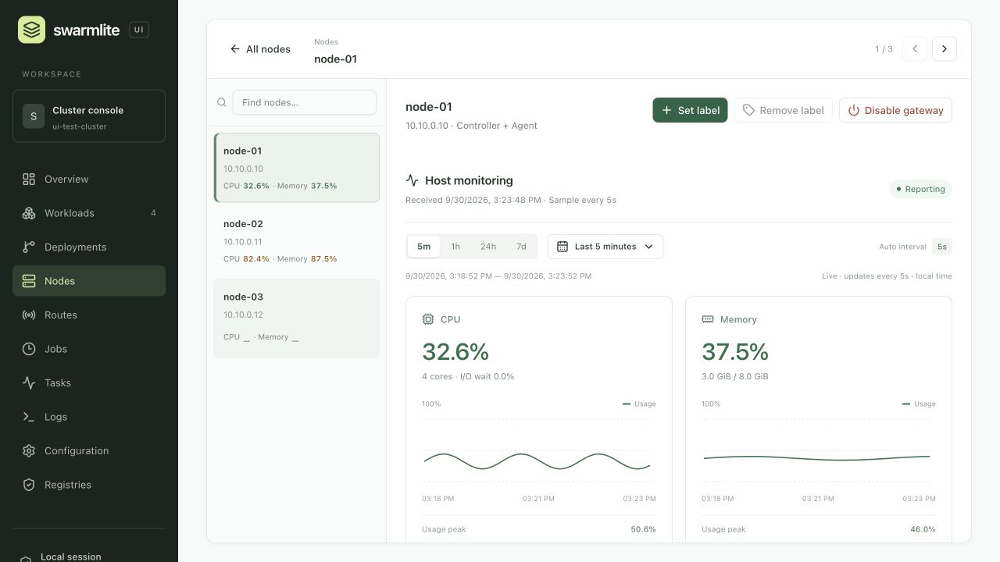
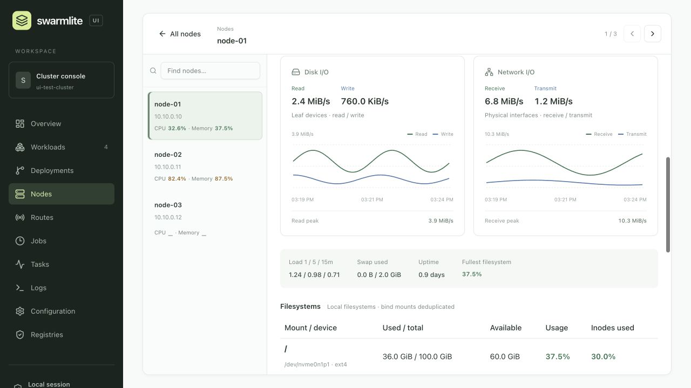
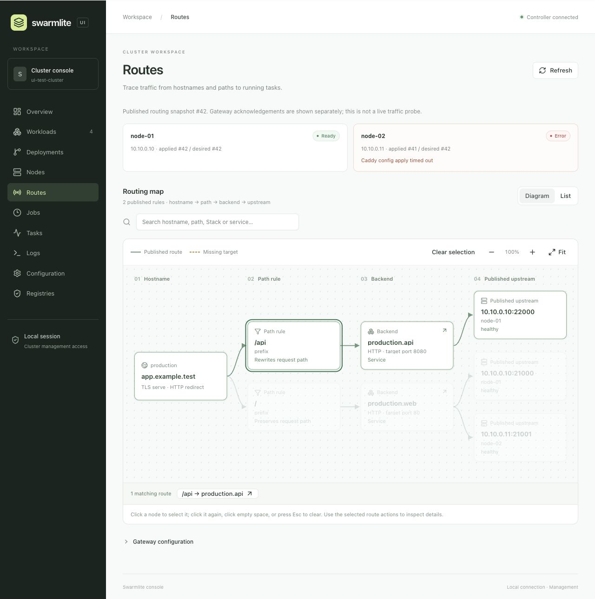
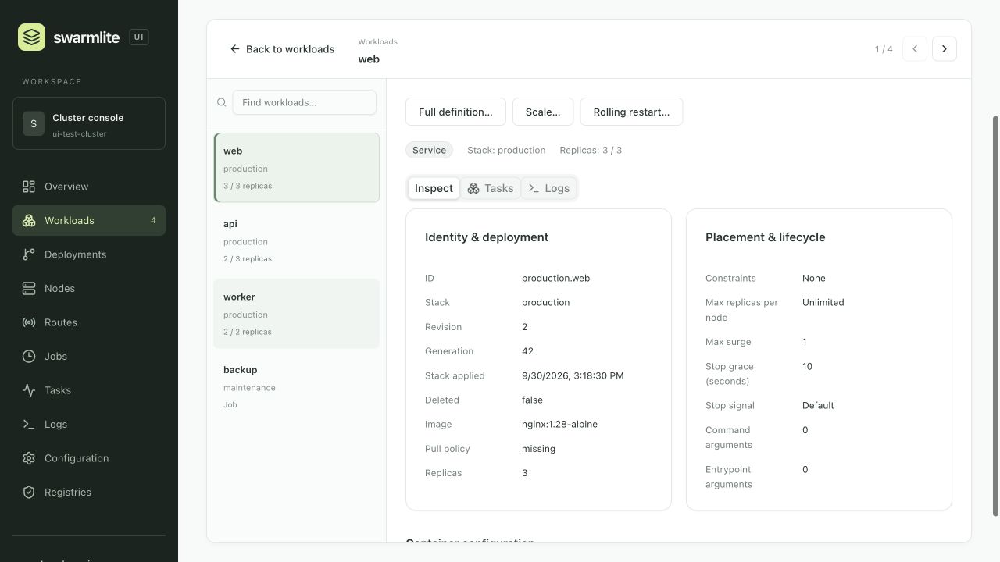

# Swarmlite

**Container orchestration for a small fleet of machines, with a CLI and an embedded Web UI.**

Swarmlite is written in Rust and runs on Docker or Podman. Deploy Compose-style Stack files,
roll out service updates, schedule jobs, publish HTTPS routes, and inspect your cluster from
one binary. It is designed for machines in a trusted LAN or region.

[Quick start](#quick-start) · [Web UI](#web-ui) · [Node monitoring](#node-monitoring) ·
[Documentation](#documentation) · [Releases](https://github.com/gfreezy/swarmlite/releases)

> [!IMPORTANT]
> Swarmlite is an MVP. It uses one fixed Controller, with no automatic failover or overlay network.
> Existing containers and accepted Gateway routes keep serving during control-process restarts;
> scheduling and management resume when the control plane returns.

## What you can do

| Capability | Included |
| --- | --- |
| Deploy services | Compose-style YAML, replicas, placement constraints, rolling updates, retry and rollback |
| Run jobs | Manual runs, cron schedules, timeouts, execution history and logs |
| Publish routes | Caddy HTTPS, hostname/path routing, rewrites, external backends and optional response caching |
| Operate visually | Resource navigation, rich inspection, routing graph, logs and contextual management actions |
| Monitor nodes | CPU, memory, filesystems, disk and network I/O; SQLite history with automatic aggregation up to 365 days |
| Manage remotely | SSH connections from the CLI and Web UI; Stack files stay on your workstation |

Linux AMD64 and ARM64 are the node targets. A macOS ARM64 CLI is also available for management.
Released binaries include the frontend; running the Web UI does **not** require Node.js.

## Quick start

This example creates one Linux node and serves two applications under one HTTPS domain.
You need a Linux server with systemd, a domain pointing to it, and public TCP ports `80` and `443`.
Keep the Controller API (`17080`) on a trusted private network.

### 1. Install and initialize

```bash
curl -fsSL https://github.com/gfreezy/swarmlite/releases/latest/download/install.sh | sudo sh
sudo swarmlite init
sudo systemctl start swarmlite
sudo swarmlite status
```

The installer reuses Docker or Podman, or installs Docker if neither is available. The first node
runs the Controller and an Agent; its Gateway is enabled by default.
[Runtime options, upgrades and uninstall](docs/operations.md#install-upgrade-and-uninstall).

### 2. Define your applications

Save this as `swarmlite.yaml`, replacing `app.example.com` with your domain:

```yaml
services:
  web:
    image: nginx:alpine
    expose: ["80"]
    deploy:
      replicas: 1

  api:
    image: traefik/whoami:latest
    expose: ["80"]
    deploy:
      replicas: 1

x-swarmlite:
  name: demo
  tls: serve
  http: redirect
  http_routes:
    - hostnames: [app.example.com]
      rules:
        - matches:
            - path: /api
          rewrite:
            strip_prefix: true
          backend:
            service: api
        - backend:
            service: web
```

### 3. Deploy and verify

Run from the directory containing `swarmlite.yaml`:

```bash
sudo swarmlite deploy
curl https://app.example.com/
curl https://app.example.com/api/
```

Caddy obtains and renews the certificate. `/api` routes to `demo.api`; other paths route to
`demo.web`. Each task gets a dynamic host port, and Swarmlite updates the Gateway upstreams.

`deploy` waits for convergence. Add `--detach` to return after acceptance; closing the CLI does
not cancel the deployment. Keep the Stack file in version control and redeploy it for application
configuration changes.

### 4. Inspect, observe and clean up

```bash
sudo swarmlite ls
sudo swarmlite ps demo
sudo swarmlite inspect demo.web
sudo swarmlite logs --follow demo.api
sudo swarmlite node stats --watch
```

Remove the example when finished:

```bash
sudo swarmlite rm demo
```

To grow the cluster, install Swarmlite on another Linux server, run the command printed by
`sudo swarmlite join-token` there, then start its service.
[Add nodes and Gateways](docs/operations.md#initialize-the-controller-and-join-nodes).

### Manage from your workstation

Install the matching CLI from [Releases](https://github.com/gfreezy/swarmlite/releases), then use SSH:

```bash
export SWARMLITE_CONTROLLER=ssh://root@server.example.com
swarmlite deploy
swarmlite ps demo
swarmlite ui
```

The CLI opens a temporary SSH tunnel and reads the protected connection settings on the server.
Your Stack file stays local. SSH aliases and `ProxyJump` are supported.
[SSH setup and non-root access](docs/applications.md#remote-management-over-ssh).

## Web UI

Open the console on your workstation:

```bash
swarmlite ui --controller ssh://root@server.example.com
```

For a local cluster, use `swarmlite ui` with access to its stored settings. To choose the local port
and print the URL without opening a browser:

```bash
swarmlite ui --port 17081 --no-open
```

The console binds to `127.0.0.1`. Open the **complete URL** printed by the command; its browser
credential lasts only for that running UI process. Keep the process running while using the console.
This is a local management session, not a hosted multi-user dashboard behind Caddy.

- Browse nodes, tasks, workloads, jobs, routes, deployments and settings with a searchable list
  beside independently scrolling details. Switch objects without scrolling back to the table.
- Inspect definitions, compare deployment generations, and open task or execution logs in drawers.
- Trace routes on a directed graph. Click a node to select it, click again to clear, and open route
  details separately. Empty space, Esc and **Clear selection** also cancel selection.
- Run management actions within their resource pages: scale/restart, job run/cancel, retry/rollback,
  Stack removal, node labels, Gateway switches, configuration changes and registry login.

The UI needs no local YAML file. `deploy`, `init`, `join`, `serve` and `upgrade` remain CLI-only.
The UI does not edit your Stack files; keep intended configuration changes in YAML for future deploys.
See the [Web UI guide](ui/README.md) for operation coverage, session behavior and frontend development.

### Screenshots

These screenshots use a local demonstration cluster with synthetic data.

**Node monitoring — switch nodes while viewing resource usage and historical trends.**



<details>
<summary>Node I/O — disk throughput, network traffic and filesystem usage</summary>



</details>

<details>
<summary>Routing map — trace a selected path from hostname to upstream</summary>



</details>

<details>
<summary>Workload inspection — browse resources without losing your place</summary>



</details>

## Node monitoring

```bash
swarmlite node stats
swarmlite node stats node-a --watch
swarmlite node stats node-a --history 24h
swarmlite node stats node-a --history 365d --json
```

Linux Agents sample CPU, I/O wait, load, memory/Swap, filesystems, disk I/O and network counters
every five seconds. The CLI shows colored utilization and stale readings; the Web **Nodes** page
adds charts, per-device details, quick ranges and custom start/end times.

The Controller keeps the latest readings and a bounded write buffer in memory. It flushes compact
history to SQLite every 30 seconds, or when the batch fills, and aggregates samples automatically:

| Resolution | Retained for |
| --- | --- |
| Original samples (~5 seconds) | 15 minutes |
| 1 minute | 24 hours |
| 1 hour | 30 days |
| 1 day | 365 days |

These are **host metrics**, not per-container statistics. Historical data survives Controller restarts;
a crash can lose the unflushed batch. Query resolution follows the oldest requested timestamp,
and aggregate buckets may extend beyond exact custom boundaries.
[Metric definitions, storage and retention](docs/operations.md#node-monitoring).

## How Swarmlite works

Each node runs `swarmlite serve`. One fixed Controller stores desired state in SQLite and assigns
work to Agents. Agents reconcile containers through Docker or Podman. Gateway nodes run Caddy,
which routes directly to each task's published host port.

The control plane is outside the serving request path. Containers, host port mappings and accepted
Caddy configuration continue operating when a control process restarts. During a partition, nodes
retain their last applied state; duplicate or stale containers can temporarily exist.

Swarmlite does not provide Controller election, automatic failover, a routing mesh, cross-node DNS,
resource reservations or autoscaling. Jobs do not guarantee strict singleton execution during
partitions. The Controller API uses bearer authentication over HTTP, so protect the private network
or provide transport protection externally.
[Architecture and tradeoffs](docs/architecture.md) · [Current limitations](docs/reference.md#current-limitations).

## Documentation

### Deploy applications

[Application guide](docs/applications.md): Stack files, scheduled jobs, templates, rolling deployments,
private registries, image proxies, configs, volumes, placement, routing and remote management.

Examples: [Services](examples/services-all.yaml) · [Jobs](examples/jobs.yaml) ·
[Routing](examples/routing-all.yaml) · [Configs](examples/configs.yaml).

### Run the cluster

[Operations guide](docs/operations.md): installation, upgrades, membership, Gateway management,
cluster settings, node monitoring and Controller recovery.

Existing schema-11 Controller databases must first pass through **v0.1.41** before upgrading to
schema-12 releases. Upgrade Controllers, Agents and management clients together.
[Upgrade notes](docs/operations.md#install-upgrade-and-uninstall).

### Reference

[Command and platform reference](docs/reference.md) · [Stack schema](crates/swarmlite-stack/schema/stack.schema.json) ·
[Gateway cache schema](crates/swarmlite-stack/schema/cache-handler.schema.json) ·
[Gateway internals](caddy-storage/README.md) · [KV API](docs/kv-api.md).

## Development

Source builds use the pinned Rust toolchain, Node.js 24 and npm:

```bash
cargo build --release --locked
```

Cargo builds and embeds the React/TypeScript/Vite frontend. No separate frontend deployment is needed.
See the [development guide](docs/development.md) for workspace structure, tests and the release workflow,
and the [UI development guide](ui/README.md#frontend-development) for Vite setup.
